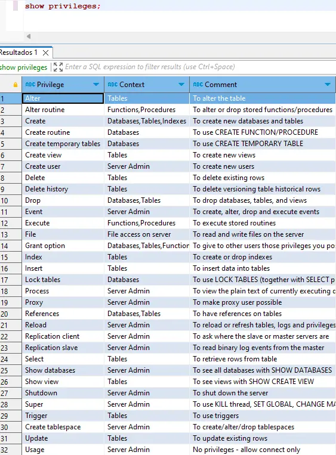

1. mysql -h localhost -u root -p
2. Porque se muestra en pantalla la contraseña
3. select version();
   \s
4. show databases();
5. use mysql;
6. show tables;
7. describe mysql.user;
8. create database prueba;
9. use prueba;
10. drop database prueba;
11. En consola cmd:
   system cls;

12. create user lector@localhost
13. create user prueba@localhost identified by "prueba"
14. select user from mysql.user
15. mysql -h localhost -u prueba -p1234  // Fijarse que el password "1234" se pone pegado a la contreña
16. drop user prueba@localhost
17. create database daw character set utf8mb4 collate utf8mb4_general_ci;
18. ALTER DATABASE daw RENAME TO daw_db;
    >⚠️ En MariaDB, efectivamente no existe una forma directa de cambiar el nombre de una base de datos como lo harías con el comando ALTER DATABASE.
19. create user administrador@localhost identified by "admin";
20. show grants;
21. show privileges;

22. show grants;
23. show grants for administrador@localhost;
24. grant all privileges on *.* to administrador@localhost;
25. flush privileges;
26. show grants for administrador@localhost;
27. grant select, usage on daw.* to lector@localhost;